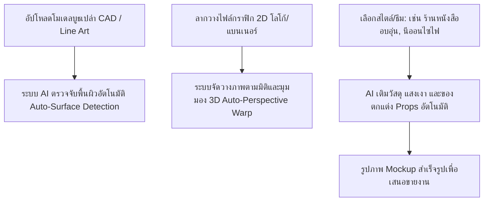

# แผนเสนอผลิตภัณฑ์ SaaS: EventSpace AI (Automated 3D Event Mockup Creator)
## เครื่องมือช่วยเหลือและยกระดับการทำงานสำหรับนักออกแบบงาน Event & Exhibition

จากการวิเคราะห์รูปภาพตัวอย่างแผนผังงาน **MRT-Naiin Roadshow 2026** ทั้ง 3 ภาพ:
1. **ภาพที่ 1:** แผนผัง Elevation 2 มิติ ขนาด 32.00 x 2.50 เมตร บอกตำแหน่งชั้นวาง เคาน์เตอร์คิดเงิน และทางเดิน
2. **ภาพที่ 2 และ 3:** ภาพจำลอง 3 มิติ Isometric โครงร่างเปล่า (Wireframe) จากมุมซ้ายและขวาของบูธ

กระบวนการทำงานที่น่าเบื่อและเสียเวลาที่สุดของดีไซเนอร์งานอีเวนต์คือ **"การนำภาพกราฟิก 2 มิติที่เพิ่งออกแบบเสร็จ ไปแปะ (Warp/Perspective Mapping) ลงบนแบบจำลอง 3 มิติเปล่าใน Photoshop"** เพื่อทำเป็นรูป Mockup ส่งเสนอลูกค้า (Pitching) หากสเกลเปลี่ยนหรือลายเปลี่ยน ดีไซเนอร์ต้องมานั่งบิดมุมใหม่ทุกครั้ง

นี่คือไอเดียสำหรับ **SaaS** ที่จะเข้ามาปฏิวัติวงการนี้ครับ:

---

## 💡 ไอเดียระบบ SaaS: "EventSpace AI"

**"อัปโหลดดีไซน์ 2D แล้วแปลงเป็นรูป 3D Mockup สวยงามพร้อมจัดแสงเงาใน 1 คลิก"**

### ฟีเจอร์หลักของระบบ (Core Features)

#### 1. Smart Surface Mapping (การแปะดีไซน์อัตโนมัติ)
* **การทำงาน:** ดีไซเนอร์อัปโหลดภาพโครงสร้าง 3D เปล่า (เหมือนในรูป 01.1_0.png) ระบบจะจดจำระนาบแนวตั้ง (Backdrop Wall), ระนาบโต๊ะ (Table skirts), และเคาน์เตอร์
* **ผลลัพธ์:** เมื่อคุณอัปโหลดไฟล์กราฟิกยาว 32 เมตร ระบบจะ **บิดมุมมอง (Perspective Warp) และแปะลวดลาย** ลงบนผนังหลังและผืนโต๊ะให้ทันทีตามสัดส่วนที่ถูกต้องในเสี้ยววินาที

#### 2. Vibe & Props Generative AI (การเติมพร็อพจัดแสงด้วย AI)
* **การทำงาน:** ดีไซเนอร์สามารถป้อนคำสั่งสไตล์ (Style Prompt) ลงไป เช่น:
  * *"สร้างร้านหนังสือนายอินทร์ Vibe อบอุ่น มีหนังสือวางอยู่บนชั้นวาง ชั้นไม้สีน้ำตาล จัดไฟวอร์มไลท์"*
* **ผลลัพธ์:** AI จะแปลงเส้นโครงร่าง (Line Art) ให้กลายเป็นภาพเสมือนจริง โดยเติมหนังสือหลากสีลงบนชั้นวาง เปลี่ยนโต๊ะผ้าธรรมดาให้เป็นโต๊ะไม้ จัดแสงเงาตกกระทบบนพื้นสถานี MRT เพิ่มคนเดินผ่านไปมา เพื่อให้รูปภาพมีมิติเหมือนถ่ายจากสถานที่จริง

#### 3. Auto-Layout Adaptation (ปรับเปลี่ยนป้ายตามสัดส่วน)
* **การทำงาน:** หากคุณมีดีไซน์หลักขนาด 32x2.5 เมตร ระบบจะใช้ AI คัดแยกส่วนประกอบของแบนเนอร์ (โลโก้, มาสคอต, ตัวหนังสือหลัก) แล้ว **ย่อ/ขยายเพื่อจัดวางใหม่ลงบนป้ายขนาดอื่นๆ** (เช่น ป้าย Roll-up, ป้ายธงญี่ปุ่น, เคาน์เตอร์คิดเงิน) โดยรักษาสมดุลความสวยงาม (Aesthetic) ของแบรนด์เดิมไว้

#### 4. Interactive Booth Configurator (เครื่องมือจัดวางแบบลากวาง)
* **การทำงาน:** ดีไซเนอร์สามารถลากโต๊ะ เก้าอี้ ชั้นหนังสือ วางลงบนแผนผัง 2 มิติ (คล้ายภาพที่ 00.1_0.png) แล้วระบบจะเรนเดอร์ภาพมุมมอง 3 มิติ Isometric (คล้ายภาพที่ 01.1_0.png) ออกมาให้ทันทีแบบ Real-time พร้อมปรับขนาดตามสัดส่วนจริง (32.00m)

---

## 💰 แผนธุรกิจและกลุ่มเป้าหมาย (Business Strategy)

* **กลุ่มเป้าหมาย (Customers):**
  * **Event Agency / Organizer:** บริษัทจัดอีเวนต์ที่ต้องการทำ Mockup ด่วนเพื่อส่งประกวดขายงาน (Pitching)
  * **Exhibition Designer:** ดีไซเนอร์บูธงานแฟร์/นิทรรศการ
  * **Brands:** แบรนด์ใหญ่ที่มีทีมออกแบบภายใน (In-house) ที่จัดโรดโชว์บ่อยๆ (เช่น สำนักพิมพ์นายอินทร์, บริษัทแบรนด์สินค้าอุปโภคบริโภค)
* **โมเดลรายได้ (Subscription Model):**
  * **Starter ($29/เดือน):** เรนเดอร์ Mockup ความละเอียดปกติ เหมาะสำหรับฟรีแลนซ์
  * **Agency Pro ($99/เดือน):** เรนเดอร์ภาพความละเอียดสูง 4K, เพิ่มพร็อพของตกแต่งแบรนด์ตัวเองได้, ทำงานร่วมกันในทีมได้ 3 คน
  * **Enterprise (Custom):** ออกแบบเทมเพลต 3D เฉพาะตัวสำหรับแบรนด์และเชื่อมต่อระบบการจัดการลิขสิทธิ์

---

## 🛠️ แนวทางการพัฒนาตัวต้นแบบ (SaaS MVP Roadmap)

เราสามารถเริ่มสร้าง **ตัวต้นแบบทางเทคโนโลยี (Technical Prototype)** บนหน้าเว็บในโฟลเดอร์นี้เพื่อพิสูจน์แนวคิดได้ดังนี้ครับ:

1. **Frontend Mockup Editor:** 
   * ทำหน้าเว็บที่แสดงรูปภาพจำลองบูธ 3D เปล่า (ภาพที่ 01 หรือ 02)
   * มีกล่องให้ดีไซเนอร์อัปโหลดภาพกราฟิก 2D
   * ใช้โค้ด **WebGL หรือ Canvas** บิดภาพ (Warp/Distort) ไปวางบนผนังจำลองตามพิกัด 3 มิติที่กำหนดไว้ ทำให้ดีไซเนอร์เห็นภาพกราฟิกของตนเองไปอยู่บนบูธจำลองได้ทันทีบนเว็บ
2. **Preset Styling:**
   * ให้ผู้ใช้สามารถกดคลิกเพื่อเลือก Vibe (เช่น "Cozy", "Modern", "Classic") แล้วระบบจะสลับภาพแบคดรอปและปรับโทนสีแสงเงาของบูธให้สอดคล้องกัน

คุณคิดว่าระบบ **"Auto-Mockup Warp & Style Generator"** สำหรับงาน Event ตัวนี้จะช่วยตอบโจทย์และแก้ปัญหาความเหนื่อยล้าของดีไซเนอร์ในชีวิตจริงได้ดีขึ้นไหมครับ? 
หากต้องการ เราสามารถเริ่มพัฒนาส่วนติดต่อผู้ใช้ (Frontend Web Prototype) ของโปรเจกต์นี้ในเครื่องของคุณได้ทันทีครับ!
