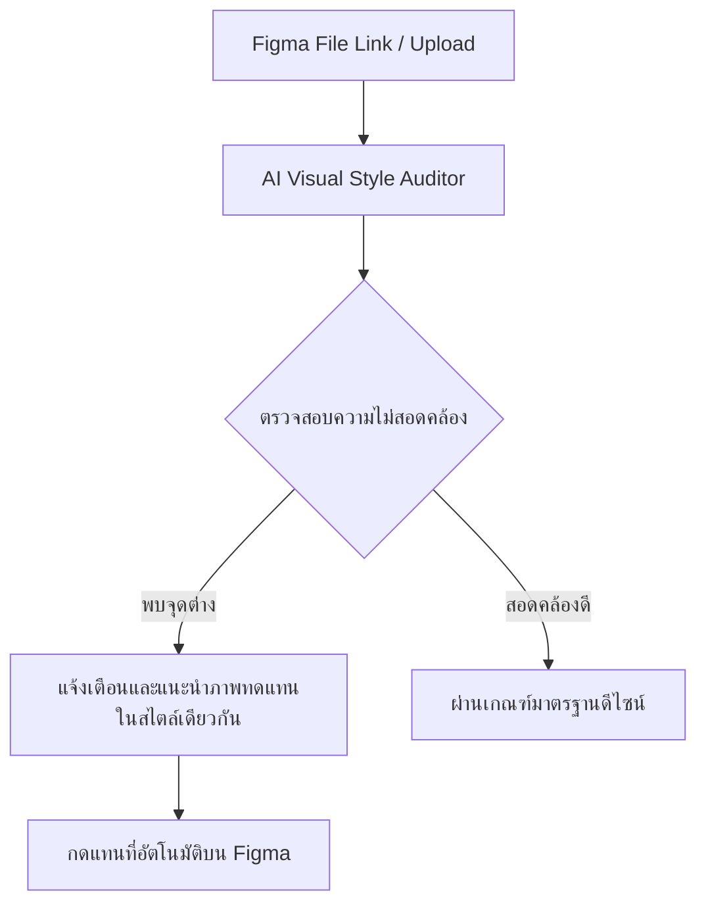

# แผนเสนอผลิตภัณฑ์ Software as a Service (SaaS)
## การประยุกต์ใช้เทคโนโลยี Visual AI & Semantic Search ในเชิงธุรกิจสร้างรายได้

เอกสารฉบับนี้วิเคราะห์โมเดลธุรกิจ SaaS 3 รูปแบบที่มีความเป็นไปได้สูงในการสร้าง พัฒนา และสร้างรายได้จากเทคโนโลยีที่เรามีอยู่ โดยเน้นการแก้ปัญหา (Pain Points) ให้กับกลุ่มเป้าหมายที่มีกำลังซื้อ (Willingness to Pay)

---

## 🚀 ผลิตภัณฑ์ที่ 1: Consistent.design (Figma Plugin & Web App)
**"เครื่องมือตรวจสอบความสม่ำเสมอของทรัพย์สินทางปัญญาในการออกแบบ"**

### 1. ปัญหาของลูกค้า (Pain Point)
ในการพัฒนาแอปพลิเคชันหรือหน้าเว็บขนาดใหญ่ ดีไซเนอร์หลายคนมาร่วมงานกัน มักจะหยิบยืมไอคอนหรือภาพประกอบจากหลากแหล่งมารวมกัน ส่งผลให้หน้าตาของงานดีไซน์ไม่สม่ำเสมอ (Inconsistent) เช่น บางตัวมีเงา บางตัวแบนราบ บางตัวหนา 1px บางตัวหนา 2px การต้องมาไล่แก้ทีละชิ้นทำให้เสียเวลาในการส่งมอบงาน

### 2. โซลูชันของ SaaS
ระบบที่จะสแกนไฟล์ออกแบบ Figma หรือโฟลเดอร์รูปภาพ แล้ววิเคราะห์ภาพเหล่านั้นด้วย AI เพื่อหาชิ้นที่สไตล์ไม่เข้าพวก พร้อมนำเสนอภาพทางเลือกที่มีโครงสร้างเส้นและสไตล์ใกล้เคียงกับภาพส่วนใหญ่ของหน้าดีไซน์นั้นๆ

### 3. แผนการสร้างรายได้ (Monetization)
* **Free Tier:** สแกนตรวจสอบได้ฟรี จำกัดจำนวนหน้าเว็บ/สไลด์ต่อเดือน
* **Pro Plan ($15/เดือน/ผู้ใช้):** สแกนได้ไม่จำกัด แนะนำทรัพยากรดีไซน์ระดับพรีเมียม กดแทนที่ภาพใน Figma ได้ทันที
* **Team & Enterprise (เริ่มต้น $49/เดือน):** ทำงานร่วมกันในทีม กำหนดมาตรฐานการออกแบบของบริษัทร่วมกันได้

---

## 🎨 ผลิตภัณฑ์ที่ 2: VibeBoard AI (Workspace สำหรับแบรนดิ้งและมาร์เก็ตติ้ง)
**"ระบบสร้างและปรับแต่ง Moodboard อัตโนมัติสำหรับการนำเสนอผลงาน"**

### 1. ปัญหาของลูกค้า (Pain Point)
ช่วงการทำ Branding หรือนำเสนอขายงานโปรเจกต์ (Pitching) เอเจนซี่ต้องรวมรวมภาพ Reference สี ฟอนต์ เพื่อทำสไลด์ Moodboard นำเสนอลูกค้าเพื่อให้เห็นทิศทางเดียวกัน การหาภาพที่คุมอารมณ์เดียวกันให้ครบ 20-30 ภาพใช้เวลาเป็นวันๆ และหากลูกค้าบอกว่า "อยากได้ Vibe ที่ดูอบอุ่นกว่านี้อีกนิด" ดีไซเนอร์ต้องเริ่มหาใหม่หมด

### 2. โซลูชันของ SaaS
ผู้ใช้งานเพียงป้อนคำบรรยายไอเดียและสีหลัก ระบบจะไปดึงภาพ ภาพถ่าย วัตถุ เลย์เอาต์ และโทนสีจากคลังภาพขนาดใหญ่มาจัดลงบนบอร์ดเสมือนจริง (Virtual Board) อย่างสวยงาม
* ดีไซเนอร์สามารถแชร์ลิงก์นี้ให้ลูกค้าเข้ามาดูและกดโหวตหรือพิมพ์แก้ไขได้
* หากลูกค้าชอบภาพที่ 3 แต่ภาพอื่นยังไม่ใช่ ลูกค้าสามารถกดปุ่ม "More of this energy" เพื่อให้ระบบปรับภาพที่เหลือทั้งหมดบนบอร์ดให้โน้มเอียงไปทางสไตล์ของภาพที่ 3 ทันที

### 3. แผนการสร้างรายได้ (Monetization)
* **Free Tier:** สร้างได้ 3 บอร์ดแชร์ดูได้อย่างเดียว
* **Creator Plan ($19/เดือน):** สร้างบอร์ดได้ไม่จำกัด ส่งออกพาเลตต์สีและรูปภาพความละเอียดสูง สามารถเชื่อมโยงกับ Canva และ Figma ได้
* **Agency Plan ($69/เดือน):** ฟังก์ชันความปลอดภัยระดับสูง เปิดระบบความเห็นของลูกค้า ปรับแต่งหน้าเว็บเป็นโลโก้ของตนเองได้ (White-labeling)

---

## 🛍️ ผลิตภัณฑ์ที่ 3: ShopVibe API (B2B E-Commerce Integration)
**"ระบบแนะนำสินค้าจากโทนสีและอารมณ์สุนทรียศาสตร์ของภาพถ่าย"**

### 1. ปัญหาของลูกค้า (Pain Point)
ร้านค้าแฟชั่น ร้านเฟอร์นิเจอร์ หรือของตกแต่งออนไลน์ มักจะสูญเสียโอกาสการขายเพราะระบบแนะนำสินค้าแบบเดิมๆ (เช่น "คุณอาจชอบเสื้อยืดคอกลมอื่นๆ") แนะนำสินค้าที่ใกล้เคียงกันเกินไป แต่ลืมมองเรื่อง **สไตล์การมิกซ์แอนด์แมตช์** หรือ **ความเข้ากันทางสุนทรียภาพ**

### 2. โซลูชันของ SaaS
ผู้พัฒนาแอป E-Commerce สามารถเชื่อมต่อปลั๊กอิน/API ของเราเข้ากับ Shopify หรือ WooCommerce ได้ ระบบจะแปลงภาพแค็ตตาล็อกสินค้าทั้งหมดของร้านค้าเป็นเวกเตอร์
* เมื่อลูกค้าดูสินค้าชิ้นหนึ่ง ระบบจะแสดงวิดเจ็ตแนะนำสินค้าชิ้นอื่น เช่น "Complete the Look" หรือ "Get the same energy decor" ซึ่งแนะนำเฟอร์นิเจอร์ชิ้นอื่นๆ ที่ไม่ได้มีรูปร่างเหมือนเตียงนอนที่ดูอยู่ แต่มีโทนสีและสไตล์ที่ตกแต่งร่วมกันแล้วดูลงตัว

### 3. แผนการสร้างรายได้ (Monetization)
* **ตามปริมาณการใช้งาน (Usage-Based):** เริ่มต้นที่ $0.005 ต่อการเรียกใช้งาน API 1 ครั้ง (API Call)
* **แพ็คเกจเหมาจ่ายสำหรับร้านค้าเล็ก:** $29/เดือน จำกัดการประมวลผลสินค้า 1,000 ชิ้นและแนะนำสินค้า 10,000 ครั้ง
* **Enterprise Plan:** สำหรับเว็บอีคอมเมิร์ซขนาดใหญ่ ปรับแต่งโมเดลการแนะนำสินค้าให้ตรงตามเป้าหมายธุรกิจได้

---

## 📊 ตารางเปรียบเทียบเพื่อตัดสินใจสร้าง MVP

| ตัวชี้วัด | Consistent.design | VibeBoard AI | ShopVibe API |
| :--- | :--- | :--- | :--- |
| **ความยากในการพัฒนา** | ปานกลาง (เน้นเจาะ API Figma) | ง่าย-ปานกลาง (สร้างเว็บแอป บอร์ดภาพ) | ยาก (ต้องจัดการระบบ API และสเกลหลังบ้าน) |
| **ความเร็วในการปล่อยสู่ตลาด (Time-to-Market)** | เร็วมาก (ทำเป็น Figma Plugin) | เร็ว (ทำเป็น Web App เดี่ยวๆ) | ช้า (ต้องสร้างปลั๊กอินลง Store Shopify) |
| **ความชัดเจนของกลุ่มเป้าหมาย** | สูงมาก (ดีไซเนอร์ UI/UX) | สูง (เอเจนซี่, การตลาด) | ปานกลาง (เจ้าของร้านค้าปลีกออนไลน์) |
| **ต้นทุนเซิร์ฟเวอร์เริ่มต้น** | ต่ำ (ประมวลผลตามคำสั่ง) | ต่ำ-ปานกลาง (เก็บข้อมูลบอร์ดภาพ) | สูง (ต้องพร้อมรับ Request ตลอดเวลา) |

---

## 🛠️ ขั้นตอนถัดไปในการสร้าง MVP (Minimum Viable Product)
หากเราต้องการเริ่มต้นสร้างต้นแบบ SaaS สักตัวบนพื้นที่ทำงานนี้ ผมแนะนำให้เลือก **Consistent.design (ตัวสแกนสไตล์ไอคอน/ภาพประกอบ)** หรือ **VibeBoard AI (บอร์ดสร้าง Moodboard)** เนื่องจากเราสามารถพัฒนาระบบหลังบ้านแบบเบาๆ ร่วมกับหน้าเว็บเพื่อทดสอบตลาดได้เร็วที่สุด

คุณสามารถพิมพ์บอกความเห็นของคุณได้เลยว่าสนใจแนวคิดไหน เพื่อที่เราจะเริ่มลงมือสร้างตัวโครงสร้างซอฟต์แวร์ทันทีครับ
