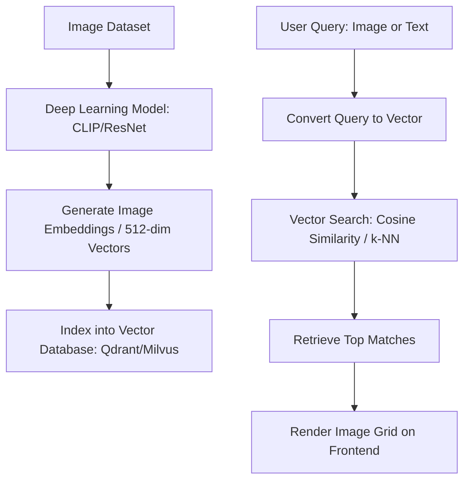

# บทวิเคราะห์ระบบ Same Energy (Visual Search Engine)

**Same Energy** (https://same.energy/) คือโปรแกรมค้นหาข้อมูลด้วยภาพ (Visual Search Engine) ที่เปิดตัวในช่วงปี 2021 โดย Jacob Jackson นักพัฒนาและวิศวกรซอฟต์แวร์ มันสร้างเสียงฮือฮาในกลุ่มนักออกแบบ ศิลปิน และนักสร้างสรรค์อย่างมาก เนื่องจากแนวคิดที่เน้นการค้นหาจาก **"Mood & Tone" หรือ "Aesthetic" (สุนทรียศาสตร์)** ของภาพ มากกว่าคีย์เวิร์ดแบบเดิมๆ

เอกสารฉบับนี้จะเจาะลึกองค์ประกอบสำคัญของ Same Energy ตั้งแต่การออกแบบ UI/UX, เทคโนโลยีผู้อยู่เบื้องหลัง, สถานะปัจจุบัน และแนวทางการพัฒนาโปรเจกต์โคลน (Clone) ขึ้นมาใหม่

---

## 1. แนวคิดหลักและประสบการณ์ผู้ใช้ (Core Concept & UX/UI)

จุดเด่นที่สุดของ Same Energy คือปรัชญาการออกแบบที่เรียบง่ายแต่ทรงพลัง:

### A. Minimalist & Immersive UI
* **ความสะอาดตา (Cleanliness):** หน้าเว็บแทบไม่มีปุ่มนำทาง ข้อความ หรือเมนูที่ซับซ้อน มีเพียงช่องค้นหาขนาดใหญ่และโลโก้ SVG สุดเก๋ที่มีลูกเล่นการซ้อนทับของสี (Mix-Blend-Mode) 
* **กระดานภาพต่อกัน (Masonry Grid):** ผลลัพธ์การค้นหาจะแสดงผลในรูปแบบ Grid ที่ไร้รอยต่อ ไม่มีช่องว่างขนาดใหญ่ (คล้าย Pinterest แต่เรียบและโฟกัสที่ตัวภาพมากกว่า)
* **Dark Mode:** พื้นหลังสีดำเข้มช่วยให้สีสันของผลลัพธ์ภาพโดดเด่นสะดุดตา

### B. Interactive Discovery Flow
* **"Same Energy" คลิกเพื่อค้นหาต่อ:** เมื่อผู้ใช้คลิกภาพใดก็ตาม ระบบจะโหลดภาพใหม่ที่มี "Mood/Tone" และ "Aesthetic" ใกล้เคียงกับภาพนั้นทันที ทำให้ผู้ใช้สามารถค้นพบไอเดียใหม่ๆ ได้เรื่อยๆ แบบไม่มีที่สิ้นสุด (Infinite Discovery Loop)
* **Drag & Drop / Image Upload:** ผู้ใช้สามารถลากรูปภาพจากเครื่องคอมพิวเตอร์ไปวางบนส่วนใดก็ได้ของหน้าจอ เพื่อเริ่มต้นการค้นหาด้วยภาพนั้นทันที
* **Text to Style (การผสมผสานคำค้นหาและสไตล์):** ผู้ใช้สามารถพิมพ์ข้อความ เช่น "forest" แล้วเลือกภาพที่ต้องการเพื่อให้ระบบค้นหา "ป่าไม้ในสไตล์และโทนสีของรูปภาพที่เลือก"

---

## 2. สถาปัตยกรรมเทคโนโลยีเบื้องหลัง (Technical Architecture)

Same Energy แตกต่างจาก Google Images ตรงที่ไม่ได้ใช้ป้ายกำกับข้อความ (Alt text / Tags) ในการระบุความเชื่อมโยงของภาพ แต่ใช้เทคโนโลยี **Deep Learning** และ **Vector Search**:



### A. Image Embeddings (การแปลงภาพเป็นคณิตศาสตร์)
ระบบใช้โมเดลโครงข่ายประสาทเทียม (Neural Networks) เช่น **CLIP (Contrastive Language-Image Pre-training)** ของ OpenAI หรือโมเดลในตระกูล **Vision Transformers (ViT)**
* โมเดลจะวิเคราะห์องค์ประกอบภาพ (ลายเส้น, แสงเงา, โทนสี, วัตถุ, อารมณ์ของภาพ) แล้วแปลงออกมาเป็นชุดตัวเลขหลายร้อยมิติที่เรียกว่า **"Vector Embeddings"**
* ภาพที่มีอารมณ์และสไตล์เดียวกัน จะมีพิกัดเวกเตอร์ที่อยู่ใกล้เคียงกันในมิตินี้

### B. Vector Database & Similarity Search
เมื่อเก็บภาพนับล้านๆ ภาพ การหาภาพที่คล้ายกันจะต้องเร็วมาก:
* ระบบจะใช้ฐานข้อมูลเวกเตอร์ (Vector Database) เช่น **Milvus, Qdrant, Faiss** หรือ **Pinecone**
* เมื่อผู้ใช้คลิกเลือกภาพ ระบบจะใช้ค่าเวกเตอร์ของภาพนั้นไปค้นหาแบบ **Approximate Nearest Neighbor (ANN)** ด้วยเกณฑ์วัด เช่น **Cosine Similarity** เพื่อดึงภาพที่มีสไตล์ใกล้เคียงกันที่สุดออกมาแสดงทันทีภายในเสี้ยววินาที

### C. Frontend Tech Stack
จากการตรวจสอบโค้ดหน้าเว็บเบื้องต้น:
* พัฒนาโดยใช้ **Next.js** (React) ร่วมกับ CSS Modules
* มีการใช้ **HTML5 Canvas** ในการคำนวณการแสดงผลและรองรับระบบ Drag & Drop รวมถึงการจัดการประมวลผลวิดีโอหรือกล้อง (มี `<canvas>` สำหรับวิดีโอในซอร์สโค้ด)

---

## 3. สถานะปัจจุบัน (Current Status)

> [!WARNING]
> **Same Energy ตกอยู่ในสถานะถูกละเลย (Abandoned/Non-functional)**
> * **ระบบล่มบางส่วน:** การสมัครสมาชิก การสร้างบอร์ดเพื่อบันทึกรูปภาพ (Saved Collections) และการอัปโหลดรูปภาพเพื่อค้นหา มักจะแสดงผลเป็น Server Error (รหัส 500) เนื่องจากไม่มีการอัปเดตและดูแลระบบเซิร์ฟเวอร์หลังบ้าน
> * **ผู้พัฒนาไม่ติดต่อกลับ:** Jacob Jackson ผู้สร้างเว็บนี้ ไม่ได้เข้ามาดูแลหรือตอบรับฟีดแบ็กของคอมมูนิตี้มานานหลายปี ทำให้ผู้ใช้หลายคนมองหาทางเลือกอื่นหรือต้องการสร้างระบบที่คล้ายกันขึ้นมาทดแทน

---

## 4. แนวทางการพัฒนา Same Energy Clone (Development Roadmap)

นี่คือโอกาสดีที่เราจะพัฒนาระบบที่มีฟังก์ชันการทำงานคล้ายกันขึ้นมาในพื้นที่การทำงานนี้ โดยใช้สแต็กสมัยใหม่:

### แผนภาพองค์ประกอบระบบที่จะพัฒนา (Target Architecture)

```mermaid
graph LR
    subgraph Frontend (React/Vite/Next.js)
        UI[Minimalist UI + Masonry Grid]
    end
    subgraph Backend (Node.js/Python)
        API[Search Router]
    end
    subgraph AI & DB Layer
        Embed[Embeddings Generator: CLIP/Transformers.js]
        VDB[Vector DB: pgvector/Qdrant]
    end
    
    UI --> API
    API --> Embed
    Embed --> VDB
    VDB --> API
    API --> UI
```

### ขั้นตอนการสร้างทีละขั้นตอน (Step-by-Step Guide)

1. **การสร้างส่วนติดต่อผู้ใช้ (Frontend & Design System)**
   * สร้างเว็บแบบ Single Page App (SPA) ด้วย React หรือ Next.js
   * ออกแบบระบบ Grid แบบ Masonry ที่รองรับ Responsive และ Infinite Scroll
   * สร้างเอฟเฟกต์การ Drag & Drop รูปภาพเพื่อใช้ค้นหา

2. **การจัดการฐานข้อมูลภาพและการดึงข้อมูล (Image Fetching & Vectorizing)**
   * **ทางเลือกที่ 1 (ประหยัด/ง่ายสุด):** เชื่อมต่อกับภาพจาก API ภายนอก เช่น **Unsplash API** หรือ **Pexels API**
   * **ทางเลือกที่ 2 (สร้างฐานข้อมูลเอง):** ดาวน์โหลดชุดข้อมูลภาพ แล้วนำมาประมวลผลผ่านโมเดล CLIP (โดยใช้ Python หรือ Hugging Face Transformers) เพื่อสร้าง Embeddings จากนั้นนำไปเก็บในฐานข้อมูลเวกเตอร์ เช่น **Supabase (pgvector)** หรือ **Qdrant**

3. **การพัฒนาฟังก์ชันการค้นหาแบบผสม (Hybrid Search)**
   * รองรับการพิมพ์ค้นหาด้วยข้อความธรรมดา
   * เมื่อผู้ใช้คลิกที่ภาพ ระบบจะยิงเวกเตอร์ไอดีของภาพนั้นไปหาค่าที่ใกล้เคียงที่สุด (Similarity Search) จากเวกเตอร์ดาต้าเบสแล้วนำกลับมาแสดงผล

---

## สรุปข้อเสนอแนะสำหรับการเริ่มโปรเจกต์นี้
คุณอยากจะทดลอง**สร้างเว็บต้นแบบ (Prototype/Clone) ของ Same Energy** ขึ้นมาใช้งานเองในเครื่องนี้ไหมครับ?
เราสามารถเริ่มสร้างจาก:
1. **Frontend Prototype:** เขียนหน้าเว็บ HTML/JS/CSS หรือ React/Next.js ที่มีหน้าตาสวยงามสไตล์ Same Energy (Grid สวยๆ, Dark Mode, ระบบลากวางรูป) โดยเชื่อมเข้ากับคลังภาพฟรีเพื่อแสดงผลก่อน
2. **Full-stack Search Engine:** เชื่อมต่อกับ API เพื่อจำลองระบบค้นหาตามโทนสีหรือสไตล์ของภาพ

**สามารถแจ้งได้เลยครับว่าอยากให้เราเริ่มทำอะไรต่อในโฟลเดอร์นี้!**
